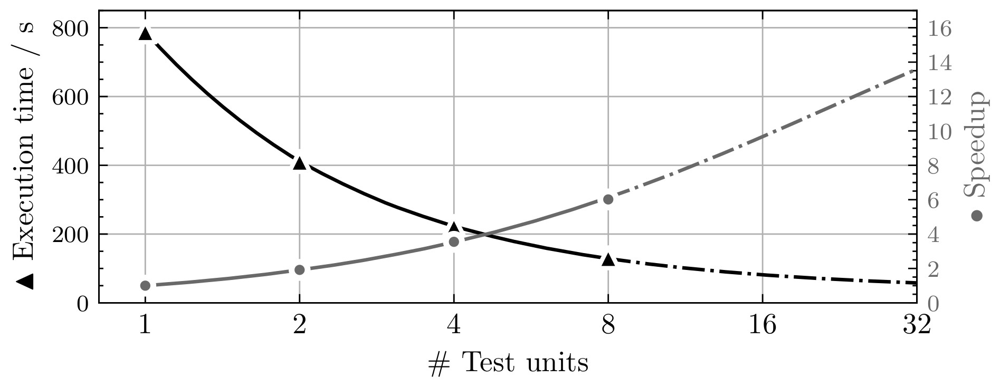

==========
Testsystem
==========

ATTEST is a python-based test system for the Real-Time Operating Systems 
course at the Institute of Technical Informatics. It was revised from scratch in the 
winter term of 2022 to improve its performance and functionality. The system utilizes 
special external hardware for testing to guarantee precise and reliable results. It is 
firmly git-oriented to embed its functionality in the best possible way.

Structure
=========

This section briefly summarizes the directory structure of the test system. There are
two directory trees, the source tree and the working tree. The :ref:`Repository
Structure` is the source directory tree and contains the code, documentation, software,
and tools required to run the test system. The :ref:`System Structure` is the working
directory tree used by the running test system.

Repository Structure
--------------------

The following section provides an overview of the repository structure with a short
description of the purpose.

.. code-block::

    /                                 : Repository root
    ├── .devcontainer                 
    |   └── devcontainer.json         : Devcontainer configuration
    ├── .vscode                       : Tasks and settings for VS Code as IDE
    ├── doc                           : Documentation source files
    ├── software                      : Libraries and tools required to run the test system
    ├── testcases                     : Source for test cases used by the test system
    ├── tests                         : Test cases used to test the test system
    ├── testsystem                    : Test system python package
    ├── .coveragerc                   : Configuration for coverage report
    ├── bootstrap.sh                  : Test system bootstrap script
    ├── conf.py                       : Sphinx configuration (Documentation generation)
    ├── index.rst                     : Documentation root
    ├── main.py                       : Test system main; Starts/runs the test system
    └── Makefile                      : Sphinx make to build documentation

System Structure
----------------

This section covers the system directory structure in greater detail. The system
structure is different than the repository structure and is used by the running test
system. The following tree depicts the used directories inside the docker container. 

.. code-block::

    /                                 : Container root directory
    ├── git                           : Directory for local git clones
    |   ├── RTOS_Public_SSXX          : Clone of public repository
    |   ├── groups                    : Directory for local group clones
    |   |   ├── RTOS_SSXX_Group01     :
    |   |   ├── RTOS_SSXX_Group02     :
    |   |   └── ...                   :
    |   └── sys                       : Clone of system repository (Report repo)
    ├── host                          : Shared directory with host for config, db, logs
    |   ├── config.json               : Test system configuration
    |   ├── testsystem.db             : Test system database
    |   └── testsystem.log            : Test system logs
    ├── root/.ssh                     : Shared directory with host for git ssh key
    ├── testcases                     : Directory of test case definitions
    |   ├── output                    : Directory for test case outputs
    |   |   └── <test_id>.txt         : Output as txt file for specific testcase
    |   ├── testbenches               : Source directory of test cases
    |   |   └── <test_id>             : Source directory for specific test case
    |   |       ├── Makefile          :
    |   |       └── ...               :
    |   └── testcases.txt             : List of test case configurations
    ├── testenv                       : Working directory for the testsystem
    |   └── <commit_hash>             : Test environment for a specific group on a 
    |       |                         :   specific commit for a specific test case
    |       ├── RTOS_Public_SSXX      : Copy of the public repository
    |       |   └── apps/testbenches  : 
    |       |       └── <test_id>     : Copy of test case source directory
    |       └── RTOS_SSXX_GroupYY     : Shadow copy of group repository
    └── testsystem                    : Contains the test system
        ├── doc                       : Documentation source
        ├── tests                     : Unit and integration tests
        ├── testsystem                : Test system python package
        ├── conf.py                   : Sphinx configuration
        ├── index.rst                 : Documentation root
        ├── main.py                   : Entry point for the test system
        └── Makefile                  : Sphinx make to build documentation

Building the docker container creates the directory *testcases* and *testsystem*. The
sources for these directories are the directories of the same name in the test system
repository. Once started, the test system will create the *git* and *testenv*
directories as needed.

Docker
======

The RTOS test system is supposed to run as a docker container. An essential aspect to
consider is that the test system needs access to the USB and COM ports of the host
system to communicate with the MSP boards and the PicoScopes. Docker provides the
``--device`` option to map host devices to a container. The disadvantage is that the
device option requires a list of specific ports on startup and does not support a
wildcard or mapping the whole /dev directory. This restriction makes it impossible for
the test system to discover new hardware on its own. The test system can only use the
devices provided by the docker run command and therefore needs a restart every time a
new device is added. 

Build and Run
-------------

The following command builds the test system image. Building the image can take a while
because it needs to compile the libmsp library from scratch.

.. code-block::

    docker build -t rts:latest .

To check if the setup works, run the *hello testsystem* program. This is the hello world
equivalent of the test system. It should greet you with basic information about the
installation and a confirmation message that everything is working fine. The *hello
testsystem* program is also handy for checking if the MSPs and PicoScopes are detected.
They will show up in the log.

.. code-block::

    docker run --rm -t -v "$(pwd)":/host rts:latest python3 main.py --hello-testsystem

.. note::

    To check if the test system detects the hardware, add the respective ports with the
    ``--device`` option (e.g.: ``--device=/dev/ttyACM0 --device=/dev/ttyACM1
    --device=/dev/bus/usb/001/003``)

To start the test system, run the *main.py* without an additional parameter. Docker
needs a volume on the host system to permanently store the config, database, and logs.
The default configuration of the test system is that it uses the */host* directory for
those files. So make sure this directory is mounted somewhere in the host system.

.. code-block::

    docker run --rm -v "$(pwd)":/host -t rts:latest python3 main.py

Other Docker Commands
---------------------

Display available commands from the test system:

.. code-block::

    docker run --rm -t rts:latest python3 main.py --help

Get a list of all MSPs and PicoScopes that have ever been connected to the test system:

.. code-block::

    docker run --rm -v "$(pwd)":/host -t rts:latest python3 main.py --list-devices

Set the display name for a device. This name is for example shown in the system report: 

.. code-block::

    docker run --rm -v "$(pwd)":/host -t rts:latest python3 main.py --set-name <SN> <NAME>

Build documentation:

.. code-block::

    docker run --rm -t \ 
        -v "$(pwd)":/host rts:latest \
        bash -c "make html && cp -R _build/html /host/documentation"

Run unit tests:

.. code-block::

    docker run --rm -t rts:latest pytest tests/unit_tests

To successfully run integration tests, make sure to use the correct device paths for MPS
and PicoScope. The following command runs integration tests with one test unit:

.. code-block::

    docker run --rm -t \
        --device=/dev/ttyACM0 \
        --device=/dev/ttyACM1 \
        --device=/dev/bus/usb/001/003 \ 
        rts:latest pytest tests/integration_tests

Hardware
========

The test system uses external hardware to run groups' test cases. It utilizes two types
of hardware, microcontroller boards, and oscilloscopes, which are connected pairwise to
form test units. A test unit consists of a microcontroller board running the real-time
operating system test case and an oscilloscope where at least one channel is connected
to a board pin to measure output signals. Which pin-to-channel connections are required
depends on the test case implementation. If this changes due to additional test cases,
update the :py:attr:`testsystem.config.Config.tu_connections` property in the
configuration to tell the test system which connections are required for a valid test
unit.

.. note::

    The current implementation requires a connection from MSP port 6 pin 0 to digital
    channel 7 on the PicoScope. **P6.0-D7**

MSP430
------

The test system uses MSP-EXP430F5529LP microcontroller boards to run the test cases for
the groups. Test cases are built by make and the msp-gcc compiler. Flashing test cases
onto the microcontrollers is handled by the MSP430Flasher. The source for both tools
lies in the software directory of the repository. They are installed when building the
docker container. The test system runs these as external tasks and processes their
output. It uses the :py:func:`~testsystem.utils.run_external_task` as a unified
interface to external tools. 

MSP boards connect to COM ports. The name of these ports starts with ttyACM followed by
a consecutive number. Each MSP exposes two COM ports: a UART port, and a debug port. 

.. note::

    New COM ports reuse free ttyACM devices. Reused COM ports allow the test system to
    detect new MSPs without a restart when the device was already mapped into the
    container.

PicoScope
---------

The test system uses PicoScope 2205A MSP 2-channel USB oscilloscopes. The PicoScopes are
primarily used to measure timing on real-time operating system tasks. Pico Technology,
the manufacturer of the PicoScope, provides an extensive C API to their oscilloscopes
with sufficient documentation and numerous examples. In addition to the C API, they
develop the `PicoSDK <https://github.com/picotech/picosdk-python-wrappers>`_, a python
wrapper to the C API functions.

PicoScopes connect as USB devices. USB devices usually do not reuse unused device
numbers. They can be discovered by using the ``lsusb`` command. The output of this
command looks similar to this:

.. code-block::

    ...
    Bus 001 Device 003: ID 0ce9:1016 Pico Technology PicoScope 2000
    ...

.. note::

    PicoScopes have an annoying behavior when newly connected to a PC. On the first
    connection, it disconnects and reconnects as a new USB device. This makes it
    impossible to use the PicoScope after it is initially connected to a PC because it
    uses a new port that was unavailable when the docker container started. This happens
    only on the first connection. Restarting the host PC does not retrigger this
    behavior as long as the scope stays connected.
    

Bootstrap Script
================

The bootstrap script bootstrap.sh automate the build and start of the test
system. The test system needs access to the PicoScopes and MSP430 boards connected via
USB to the host. The script builds the test system container if it does not exist,
builds the device connection string based on the USB devices present at the host, and
starts the test system container. The script runs the container in detached mode. That
means the test system no longer uses the terminal after the build process and runs in
the background. To reattach the terminal to the test system, use the following command: 

.. code-block::

    docker attach --sig-proxy=false rts

The previous command only shows the test system output. By pressing ``CTRL`` + ``C``, the
terminal gets detached, but the test system continues in the background. To terminate
the test system, either set ``--sig-proxy`` to true when attaching or set the
:py:attr:`~testsystem.config.Config.stop` property in the configuration.

Group Testing
=============

Groups will be tested when they push new commits to the primary branch
(:py:attr:`~testsystem.config.Config.git_primary_branch_name`). The scheduler
periodically checks the student repositories for new commits and schedules test case
tasks if a new commit is present. The interval in which a student repository is checked
for new commits is not constant and depends on how busy the test system is. When a new
commit is detected and scheduled for testing, the test system won't recheck the group
until the test run is completed. This is to stay caught up on work and deliver
up-to-date results when the test system has high utilization. The *force test tags*
feature allows the specification of tags that will be tested anyways. This is to ensure
test results for commits that definitely require a test report. Submission commits, for
example. These tags can be configured with the
:py:attr:`~testsystem.config.Config.force_test_tags` property.

Task Scheduling
===============

The scheduling thread handles task scheduling on the test system. This thread runs
asynchronously to the worker threads, which execute the tasks assigned by the scheduler.
Each task has a priority (lower values have higher priority) and, optionally, a fixed
test unit it should run on. Each test case for a group and a commit is scheduled as an
individual task. Test case tasks for a test run are not set to a specific test unit and
can run on any test unit. This, in combination with group priorities, results in all
test units being used for a single group until the test run is finished. Then the next
group will use all test units for its test run.

.. note::
    If a test case task fails because of an external error (e.g., MSP430Flasher not
    responding), the task is scheduled again with a priority of 9. The default priority 
    range for test case tasks is 10 to 20.

The scheduler periodically checks the group repositories for new commits and, if
available, schedules test case tasks based on the current exercise configuration
:py:attr:`~testsystem.config.Config.exercise_nr` for execution. Only the most recent
commit will be scheduled, and new commits will be considered once the test run is
finished. The following timing example should clarify which commits will be scheduled
and tested by the test system:

.. code-block::

    Group                           Test system
    ├─ Commit C1                    |
    ├─ Commit C2                    |
    |                               ├─ Test system is started
    |                               ├─ Start testing C2
    ├─ Commit C3                    ├─ Testing C2 ...
    ├─ Commit C4                    ├─ Testing C2 ...
    ├─ C2 Report available          ├─ Finished testing C2
    |                               ├─ Start testing C4

Priorities
----------

The following table lists the used task priorities from high priority to low priority.

.. csv-table:: Used Task Priorities
    :header: "Priority Value", "Description & Usage"
    :widths: 10, 50

    "5", "Priority for legacy tasks. All tasks in the queue at the time of a priority
    reset get this priority assigned no matter what their previous value was."
    "9", "If a task fails because a test unit stopped responding and the test case timed out, the task will be rescheduled with this priority."
    "10 - 20", "Priority range used for group test case tasks. The priority is computed based on the time the group spent waiting in the queue."
    "25", "Used for tagged commit tests. Commits tagged with a force test tag (specified in configuration) will used this priority."

Logging
=======

The test system has two different logging providers configured: terminal logging and
file logging. The system prints all logs with priority *INFO* or higher to the terminal to
give a live view of the test systems actions. Additionally to the terminal, the logs are
written to a log file. File logging is customizable by setting
:py:attr:`~testsystem.config.Config.log_file` and
:py:attr:`~testsystem.config.Config.log_level`, which sets the destination and level,
respectively.

Parallelization
===============

Using multiple test units allows parallelizing test case tasks and, therefore, enables
horizontal scaling of the test system. The following table and figure show how the
number of test units affects the execution. The tests were run with a single group, a
working final OS submission, and all 57 test cases.

.. csv-table:: 
    :header: "# TUs", "Exec. time (s)", "Speedup", "Speedup (previous)", "Parallelization portion (Amdahl's law)"
    :widths: 10, 20, 20, 20, 20

    "1", "788", "\-", "\-", "\-"
    "2", "411", "1.92", "1.92", "0.958"
    "4", "222", "3.55", "1.85", "0.958"
    "8", "131", "6.02", "1.69", "0.953"

The following figure depicts the possible speedup and execution time based on the number
of test units and a parallelization factor of 0.956 (average from measurements). The
blue curve shows the calculated speedup according to Amdahl's law, and the green curve
depicts the expected execution time for a test run with all 57 test cases. The number of
test cases also marks the upper bound for the number of test units because a test case
is the smallest possible undividable unit of work in this context. 

Contribution & Development
==========================

The recommended way for developing the test system is by using VSCode and the
development container feature. The project contains a dev container configuration for
VSCode to make contributions as easy as possible. To start the dev container, press
``CTRL`` + ``SHIFT`` + ``P``, type ``Dev Containers: Open Folder in Container...`` and
select the cloned test system directory. The dev container configures the environment,
includes all the required packages, and contains some useful VS Code extensions for
development. If test units are available, add the respective devices to the ``runArgs``
section in the ``.devcontainer`` file and restart the container by typing ``Dev
Containers: Rebuild Container`` into the VSCode Command Palette. 